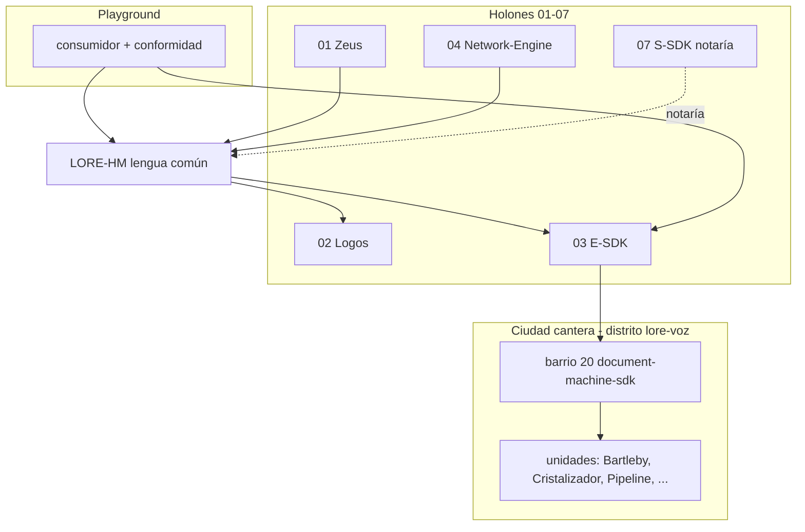

# Mapa holónico · LORE-HM

> Cartografía de escalas **sin confundirlas**. LORE-HM cruza holones 01–04 y
> queda gobernada/notariada por 07. **No** crea holón 08 ni `L_SDK`.

## Leyenda de estados

- **verificada** — evidencia citada en `FUENTES.md` o medida en spike 112
- **hipótesis** — intención del plan; falta evidencia runtime
- **decisión pendiente** — requiere tick del custodio

## Cadena 01–07 (holones / mundos narrativos)

| # | nombre metodológico | pieza técnica ancla | rol respecto a LORE-HM | estado |
| - | ----------------- | ------------------- | ---------------------- | ------ |
| 01 | Mythos | zeus-sdk / Z_SDK | contratos tipados, forces, línea; MCP consumido como wrapper | **verificada** — `C:\S_LAB\s-sdk\WPS_QUEUE\investigacion-holones-s-sdk.md` |
| 02 | Logos | (destilado) `@logos/*` candidato | **dueño conceptual** de la lengua LORE-HM una vez promovida | **hipótesis** — paquete no creado; ver `02-logos.md` |
| 03 | Revelación | **E-SDK / emmanuel-sdk** | **mundo** que encarna Document Machine y sound system | **verificada** — ver §E-SDK abajo |
| 04 | Ilustración | Network-Engine / AOS | laboratorio de lenguajes; protocolo de incubación heredado | **verificada** — `04-ilustracion.md`, ruta LANGUAGES en FUENTES |
| 05 | Sospecha | aleph-scriptorium (digestión) | **cantera histórica**; no runtime dep | **verificada** — plan cola A §fase 0.3 |
| 06 | Posmodernidad | constelación / fragmentos | **cantera histórica**; no runtime dep | **verificada** — idem |
| 07 | Método | **S-SDK (SCRIPT_SDK)** | notaría, junturas, anclas; **nunca** código de mundos | **verificada** — DE-I13, `07-script-sdk.md` |

**verificada** — `HOLONES.md` mantiene **siete filas**; LORE-HM aparece como
costura ejecutable/paquete, no octavo holón (`WPS_QUEUE/plan.md` §44).

## Escala E-SDK (holón 03) — no confundir con barrio ni unidad

| categoría | valor | aclaración | estado |
| --------- | ----- | ---------- | ------ |
| Holón / mundo | **E-SDK** (03) | ownership del sound system; **no** es un barrio | **verificada** — `WPS_QUEUE/plan.md` §30 |
| Distrito (ciudad cantera) | `lore-voz` | escenario gamificado en cantera CIUDAD | **verificada** — `CENSO-ESTADOS.md` |
| Barrio | `document-machine-sdk` (#20) | pieza de E asociada al distrito lore-voz | **verificada** — idem |
| Unidades / edificios | ver tabla siguiente | agentes y módulos **dentro** del barrio 20 | **verificada** — ficha barrio 20 + spike 112 |

**verificada** — Confundir E-SDK con barrio 20 o con una unidad viola el CA de
L01 y el plan cola A.

## Unidades del barrio 20 (document-machine-sdk)

| unidad | función declarada | proceso real hoy (spike 112) | estado |
| ------ | ----------------- | ---------------------------- | ------ |
| Bartleby | ingestión / editorial | definición `.agent.md` OASIS; **no corre** como CLI | **verificada** — REPORTE-WP-HUB-112 |
| Cristalizador | cristalización de artefactos | definición existe; **no corre** | **verificada** |
| Pipeline | orquestación handoffs | definición existe; **no corre** | **verificada** |
| Grafista | proyección visual / layout | citado en plan y cantera | **hipótesis** — no medido en spike |
| Demiurgo | generación estructural | citado en plan y cantera | **hipótesis** |
| Dramaturgo | línea dramática / escenas | citado en plan y cantera | **hipótesis** |

**verificada** — Cadena mínima B→C→P **no corre** hoy; el lenguaje describe
simulacro playground hasta superficie de proceso E.

## Playground (hub / scriptorium)

| rol | declaración | estado |
| --- | ----------- | ------ |
| Consumidor | usa `@logos/lore-hm` (futuro), contratos Zeus, provider E o contingencia | **hipótesis** — package aún no publicado |
| Banco de conformidad | verificador externo, evidencia offline, negativos fail-closed | **verificada** — plan cola A §35–40 |
| **No** dueño del dominio | schemas locales no son segundo lenguaje | **verificada** — plan §35 |

**verificada** — Escenario canónico declarado:
`C:\S\scriptorium\playground\prueba-de-H-M\` (ownership hub; S_RO).

## Materiales 05–06

**verificada** — Holones 05 (Sospecha) y 06 (Posmodernidad) aportan **cantera
histórica y contenido** (aleph-scriptorium, constelación); **no** son
dependencias runtime de LORE-HM (`BACKLOG-F2.md` lane LENGUA, CA L01).

## Junturas activas (costura LORE-HM)

| juntura | archivo | relación LORE-HM | estado |
| ------- | ------- | ---------------- | ------ |
| 01↔02 | `01-02-mythos-logos.md` | zeus aporta forces/línea; Logos destila lengua | **verificada** |
| 02↔03 | `02-03-logos-revelacion.md` | vocabulario griego → Encarnación; E encarna provider | **verificada** |
| 03↔04 | `03-04-revelacion-ilustracion.md` | incubación lenguaje en 04; activación en 03 | **verificada** |
| 01↔03 (notaría) | `2026-07-16-dossier-notaria-tres-liturgias.md` | madurez E01+E11 antes de promover Logos | **verificada** |

**decisión pendiente** — Actualizar texto de junturas 01↔02, 02↔03, 03↔04 con
costura LORE-HM solo tras criterio notarial de madurez (plan §44).

## Diagrama de escalas (referencia)

**hipótesis** — El diagrama es cartografía declarativa; no implica dependencias
runtime actuales.

## Herencia spike 112 (FM viva)

**verificada** — Veredicto **NO CORRE** para «H y M operan procesos reales FM
con Onfalo hoy». Implicación: el mapa distingue **definiciones** (existen en
OASIS) de **procesos** (no invocables) y **runtime E** (submódulos vacíos al
medir).

**verificada** — Import-once Onfalo **sí** es viable como eslabón de material
real sin montar OASIS en runtime (spike §reorden, ficha 104).
