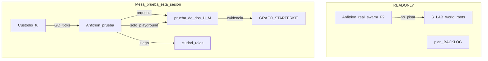

# Roadmap · Anfitrión de prueba (prueba-de-dos → ciudad)

## Premisas (cerradas)

- **Anfitrión real / swarm** sigue implementando backlogs F2 (incluido S) en `C:\S_LAB\*` y `plan/`. Esta sesión **no** edita esos árboles ni hace push de obra.
- **Anfitrión de esta mesa** = esta ventana: orquesta ticks de prueba, rutea roles, registra evidencia, **no decide fondo de producto**.
- **Escritura permitida:** solo bajo [`playground/`](c:\S\scriptorium\playground) (handoffs regenerables, registro de corrida, grafo de marcas cuando haya evidencia). **Prohibido mutar** [`sincronia/`](c:\S\scriptorium\sincronia) del hub, `plan/BACKLOG*`, `codebase/*` gitlinks, ni world_roots LAB.
- **Lectura OK:** sala hub, PROTOCOLO, packs/estructura, reports ajenos como cita.
- **Reparto fase 1:** yo = Anfitrión-mesa + operador **H** (host: nodo/autoridad); tú = custodio + operador **M** (visitante). Fase 2: tú abres ventanas extra según ticks que yo emita.



## Fase 0 · Boot de mesa (antes de tocar H/M)

1. Declarar identidad: **Anfitrión-prueba** (no S-vigía ni Anfitrión-hub).
2. Crear gobierno mínimo en playground (un solo sitio, no sala hub), p.ej. [`playground/MESA-PRUEBA/`](c:\S\scriptorium\playground) con:
   - `INDICE.md` — fase actual, quién es quién, cerco READONLY
   - `TICKS.md` — ticks emitidos (append)
   - `BITACORA.md` — corridas y hashes de evidencia
3. Inventario RO de estado actual:
   - Grafo: [`GRAFO-STARTERKIT.md`](c:\S\scriptorium\playground\prueba-de-dos\GRAFO-STARTERKIT.md) — **Z ya marcado** (U187); no reabrir.
   - Kit PD2: [`manual.md`](c:\S\scriptorium\playground\prueba-de-dos\manual.md), [`SKILL.md`](c:\S\scriptorium\playground\prueba-de-dos\SKILL.md), handoffs H/M.
   - Ciudad: [`ciudad/manual.md`](c:\S\scriptorium\playground\ciudad\manual.md) — 5 roles.
4. Checklist cerco (antes de cada mutación playground): ¿toca `plan/` o LAB? → abortar.

## Fase 1 · Prueba de dos (tú + yo)

Fuente de verdad del CA: [`manual.md` §5](c:\S\scriptorium\playground\prueba-de-dos\manual.md).

| paso | quién | acción |
| ---- | ----- | ------ |
| 1.1 | Anfitrión | Tick `PD2-BOOT`: `npm run generate A_B` si hace falta; verificar stack/registry |
| 1.2 | H (yo) | Seguir [`handoff-H.md`](c:\S\scriptorium\playground\prueba-de-dos\handoffs\handoff-H.md): nodo `:3017` o URL externa; `npm run autoridad`; declarar vía peercard |
| 1.3 | M (tú) | Seguir [`handoff-M.md`](c:\S\scriptorium\playground\prueba-de-dos\handoffs\handoff-M.md): identidad; entrar misma room |
| 1.4 | ambos | CA: misma room · verse · ≥1 acto autoridad reflejado · identidad declarada · registro en handoffs |
| 1.5 | Anfitrión | Cerrar corrida en `MESA-PRUEBA/BITACORA.md`; lo no visto = `<pendiente>` |

**Grafo holón-7 (secundario en esta fase):** solo estampar filas con entrada MCP real y tick de marca. Candidatos naturales de esta mesa: **S** (auth barrio) y **custodio** (auth ciudad) si la corrida H/M lo evidencia; no inventar marcas V/G/O/L. Z queda como está.

## Fase 2 · Playground ciudad (ventanas paralelas)

Evolución documentada en [`ciudad/manual.md`](c:\S\scriptorium\playground\ciudad\manual.md). Orden de apertura (yo pido; tú creas ventana Cursor):

1. **autoridad** (obligatoria) — nodo + engine; room `CIUDAD_DEMO`.
2. **corriente** (mínimo jugable con autoridad).
3. Luego, según CA y carga: **visitante** → **residente** → **cronista**.

Por cada ventana: tick corto `CIU-<rol>` con ALCANCE = handoff del rol + qué verbo demostrar. Anfitrión no juega todos los roles: rutea y consolida evidencia en bitácora.

CA ciudad ([manual §6](c:\S\scriptorium\playground\ciudad\manual.md)): autoridad arriba · todos en room · cada rol ejerce su verbo y otro lo ve · identidad · handoffs rellenos. Gap conocido v0.1.0: `player_join` sin `playerType` → observar, no parchear.

## Fase 3 · Cierre y entrega al hub (sin usurpar)

- Acta corta en `MESA-PRUEBA/` (qué se validó, fricciones, marcas grafo si hubo).
- Si el custodio quiere espejo en sala hub / CUADERNOS: **tick aparte** del Anfitrión real o GO explícito — esta mesa no escribe `sincronia/` por defecto.
- Relación con backlog S (S100/S101, etc.): **solo observación**; implementación = swarm.

## Protocolo operativo (estilo sala, acotado)

```text
TICK <id> · TO=<H|M|rol-ciudad|Anfitrión> · ALCANCE=<acción exacta>
```

- Sin tick → no procesar mutaciones de prueba.
- Una nota/registro por turno en el handoff de la ventana.
- PING opcional solo dentro de `MESA-PRUEBA/` (no timbres de carriles LAB).
- Push: ninguno de obra; playground según política git del repo scriptorium (custodio decide).

## Qué no entra en este roadmap

- Implementar WPs F2 / U* del swarm.
- Merge/push a `S_SDK` / `Z_SDK` / etc.
- Reactivar watchers de vigilancia.
- Resolver peercard-reúso (pregunta abierta del grafo) — solo anotar si aparece en corrida.
