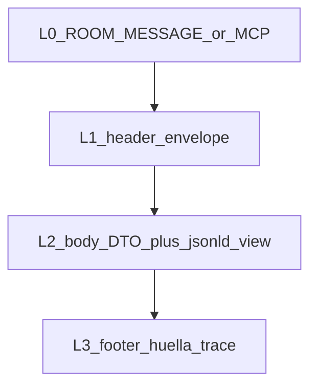

# Delta · PD2 verbos + JSON-LD (ancla mesa)

## Ancla (no repetir)

Fuente operativa de cerco, roles, fases 0/2/3, ticks y “qué no entra”:

- [mesa_prueba_playground_0c3520d6.plan.md](c:\S_LAB\s-sdk\.cursor\plans\mesa_prueba_playground_0c3520d6.plan.md)

Este plan **solo sustituye/amplía Fase 1** (y el inventario RO mínimo de Fase 0). Todo lo demás del ancla sigue vigente: Anfitrión-prueba, escritura solo `playground/`, Z intacto, ciudad después, sin sync hub sin GO.

Insumo externo (cita, no merge desde esta mesa):

- Pack SOLID×MCP ronda 2 — [Z_SDK#55](https://github.com/alephscriptorium-eng/Z_SDK/pull/55) (`plan/solid/`: §T3–§T6, DIC-2/DIC-4, SM05/SM06/SM08). Espejos O_SDK#1 / games-library#4.

## Premisas nuevas (cerradas)

- Wire runtime H/M sigue siendo **JSON DTO** de `@zeus/protocol` + tools ciudad (`join` / `walk` / `announce` / `wake` / `sleep` / `state`). No se exige que el engine acepte JSON-LD en caliente.
- Evidencia en playground: **pareja wire + vista JSON-LD** por verbo (SM05 aditivo). Turtle = kata secundaria LDP, no wire rooms.
- Backbone vocab en vistas: AS2 + PROV-O + DCTERMS + `zsdk:` provisional; schema.org solo si un término no cabe (DIC-2 ✎).
- Hash: pie = `huellaLedger` / bytes del snapshot sellado; **no** hashear la vista RDF (DIC-4 ✎).
- Solid/CSS (SM02) fuera de esta corrida; solo vocabulario/vistas como kata hacia ola D.

## Capas de mensaje (sobre envelope existente)



| capa | campos vivos hoy | en evidencia MESA |
|------|------------------|-------------------|
| L0 | `ROOM_MESSAGE` / tool call | URL nodo, room, tool name |
| L1 header | `v`, `game`, `kind`, `from`, `ts`, `actorId`, `role?`, `peerCard?` ([CONTRATO.md](c:\S\scriptorium\codebase\z-sdk\packages\engine\protocol\spec\CONTRATO.md)) | copiar literal del wire |
| L2 body | args intent / snapshot | + archivo `*.jsonld` con `@context` / `@type` |
| L3 footer | ledger / `huellaLedger` / tick | anotar huella; `traceparent` si aparece |

## Delta Fase 0 · inventario extra

Además del checklist del ancla, en [`playground/MESA-PRUEBA/`](c:\S\scriptorium\playground) (o crear al boot):

- `INDICE.md`: fase + enlace al plan ancla + enlace Z_SDK#55.
- `VOCAB-VERBO.md`: tabla verbo Zeus → AS2/`zsdk:` (provisional hasta SM04/SM06). Filas mínimas: `join`, `walk`, `announce`, `wake`, `sleep`, `state`.
- Cerco: sin cambios.

## Delta Fase 1 · matriz de ticks H/M

Sustituye el CA “≥1 acto” del ancla por ticks unitarios. Plantillas: [manual.md](c:\S\scriptorium\playground\prueba-de-dos\manual.md), [handoff-H.md](c:\S\scriptorium\playground\prueba-de-dos\handoffs\handoff-H.md), [handoff-M.md](c:\S\scriptorium\playground\prueba-de-dos\handoffs\handoff-M.md).

| tick | TO | ALCANCE |
|------|-----|---------|
| `PD2-BOOT` | Anfitrión/H | `generate` si falta; nodo + `npm run autoridad`; room viva |
| `PD2-ID` | H y M | declarar vía peercard en Registro |
| `PD2-JOIN` | M emite / H confirma | join + presencia mutua |
| `PD2-WALK` | M / H | walk reflejado |
| `PD2-ANNOUNCE` | M / H | announce reflejado |
| `PD2-WAKE` | M / H | wake / estado vivo |
| `PD2-SLEEP` | M / H | sleep / latente o salida |
| `PD2-STATE` | ambos | `state`/ledger: mismos hechos ≥N actas |
| `PD2-JSONLD` | Anfitrión | por cada verbo PASS: guardar wire + vista `.jsonld` bajo `MESA-PRUEBA/evidencia/` |
| `PD2-CA` | Anfitrión | matriz PASS/FAIL/`<pendiente>` en `BITACORA.md`; gap `playerType` solo observar |

Por verbo PASS, evidencia mínima:

```text
evidencia/<tick>-wire.json      # payload real
evidencia/<tick>-view.jsonld    # mismo cuerpo + @context (no hasheado)
```

`@context` mínimo (provisional, documentado en `VOCAB-VERBO.md`):

- `as` → ActivityStreams 2.0  
- `prov` → PROV-O  
- `dcterms` → DCMI  
- `zsdk` → namespace provisional (hash/URL `<pendiente>` hasta SM04)

## Fase 1b / 2 / 3

Sin reescritura: grafo solo con evidencia real; ciudad reutiliza la misma matriz de verbos por rol; acta de cierre cita fricciones y “listo para SM05/SM06” como observación. No merge del pack SOLID desde esta mesa.

## Qué no entra (además del ancla)

- Parchear `@zeus/ciudad` / protocol para JSON-LD nativo.
- Turtle en wire rooms.
- Cerrar DIC-2/DIC-4 (solo aplicar recomendados ✎ en evidencia).
- Implementar CSS/pods (SM02+).
