# Grafo de handoffs — capa 5

> Scope: `.github_V1` (plaza + plugins). Handoffs desde YAML frontmatter.

**Edges parseados**: 513
**Agentes con salida**: 64
**Targets únicos**: 94

## Top emisores (out-degree)

| Agente | Salidas |
|--------|--------:|
| `ox` | 25 |
| `plugin_ox_prologeditor` | 20 |
| `periodico` | 19 |
| `indice` | 18 |
| `scrum` | 18 |
| `plugin_ox_mcppresets` | 16 |
| `aaia-editor` | 16 |
| `aleph` | 15 |
| `plugin_ox_typedprompting` | 12 |
| `revisor` | 12 |
| `agent-creator` | 12 |
| `openasyncapi-editor` | 12 |
| `prolog-editor` | 12 |
| `ghpages` | 11 |
| `plugin_ox_novelist` | 10 |
| `plugin_ox_scrum` | 10 |
| `teatro` | 10 |
| `plugin_ox_argboard` | 9 |
| `plugin_ox_teatro` | 9 |
| `plugin_ox_wireeditor` | 9 |

## Top destinos (in-degree)

| Agente | Entradas |
|--------|--------:|
| `Ox` | 31 |
| `Indice` | 21 |
| `plugin_ox_mcppresets` | 18 |
| `AAIAEditor` | 17 |
| `Scrum` | 16 |
| `PrologEditor` | 14 |
| `.github/plugins/consejo-asesor/agents/consejo-asesor.agent.md` | 13 |
| `plugin_ox_prologeditor` | 13 |
| `Aleph` | 12 |
| `OpenAsyncApiEditor` | 11 |
| `plugin_ox_ghpages` | 10 |
| `LoreSDK` | 10 |
| `Teatro` | 10 |
| `WireEditor` | 10 |
| `ForoScraper` | 9 |
| `.github/plugins/agent-creator/agents/agent-creator.agent.md` | 9 |
| `NodejsNotebooks` | 9 |
| `.github/plugins/novelist/agents/novelist.agent.md` | 9 |
| `.github/plugins/scrum/agents/scrum.agent.md` | 9 |
| `TypedPrompting` | 9 |

## Mermaid (hubs top-12 → destinos únicos, máx 80 edges)

```mermaid
flowchart LR
  aleph[aleph] --> Blueflag[Blueflag]
  aleph[aleph] --> Blackflag[Blackflag]
  aleph[aleph] --> Redflag[Redflag]
  aleph[aleph] --> Revisor[Revisor]
  aleph[aleph] --> yellowflag[yellowflag]
  aleph[aleph] --> Orangeflag[Orangeflag]
  aleph[aleph] --> Ox[Ox]
  aleph[aleph] --> Indice[Indice]
  aleph[aleph] --> plugin_manager[plugin-manager]
  aleph[aleph] --> plugin_ox_consejoasesor[plugin_ox_consejoasesor]
  aleph[aleph] --> plugin_ox_loresdk[plugin_ox_loresdk]
  aleph[aleph] --> plugin_ox_vectormachine[plugin_ox_vectormachine]
  indice[indice] --> Indice[Indice]
  indice[indice] --> plugin_ox_vectormachine[plugin_ox_vectormachine]
  indice[indice] --> Ox[Ox]
  ox[ox] --> Ox[Ox]
  ox[ox] --> Aleph[Aleph]
  ox[ox] --> Blueflag[Blueflag]
  ox[ox] --> plugin_manager[plugin-manager]
  ox[ox] --> Indice[Indice]
  ox[ox] --> plugin_ox_loresdk[plugin_ox_loresdk]
  ox[ox] --> plugin_ox_vectormachine[plugin_ox_vectormachine]
  periodico[periodico] --> Periodico[Periodico]
  periodico[periodico] --> ForoScraper[ForoScraper]
  periodico[periodico] --> Blueflag[Blueflag]
  periodico[periodico] --> Blackflag[Blackflag]
  periodico[periodico] --> Redflag[Redflag]
  periodico[periodico] --> yellowflag[yellowflag]
  periodico[periodico] --> Orangeflag[Orangeflag]
  periodico[periodico] --> GHPages[GHPages]
  periodico[periodico] --> _github_plugins_arg_board_agents_Arrakis[.github/plugins/arg-board/agents/Arrakis]
  periodico[periodico] --> _github_plugins_agent_creator_agents_agent_creator_agent_md[.github/plugins/agent-creator/agents/agent-creator.agent.md]
  plugin_ox_mcppresets[plugin_ox_mcppresets] --> plugin_ox_mcppresets[plugin_ox_mcppresets]
  plugin_ox_prologeditor[plugin_ox_prologeditor] --> plugin_ox_prologeditor[plugin_ox_prologeditor]
  plugin_ox_prologeditor[plugin_ox_prologeditor] --> _github_plugins_prolog_editor_agents_prolog_editor_agent_md[.github/plugins/prolog-editor/agents/prolog-editor.agent.md]
  plugin_ox_typedprompting[plugin_ox_typedprompting] --> plugin_ox_typedprompting[plugin_ox_typedprompting]
  plugin_ox_typedprompting[plugin_ox_typedprompting] --> _github_plugins_typed_prompting_agents_typed_prompting_agent_md[.github/plugins/typed-prompting/agents/typed-prompting.agent.md]
  plugin_ox_typedprompting[plugin_ox_typedprompting] --> Ox[Ox]
  revisor[revisor] --> Aleph[Aleph]
  revisor[revisor] --> Blackflag[Blackflag]
  revisor[revisor] --> Redflag[Redflag]
  revisor[revisor] --> yellowflag[yellowflag]
  revisor[revisor] --> Orangeflag[Orangeflag]
  revisor[revisor] --> GHPages[GHPages]
  revisor[revisor] --> _github_plugins_arg_board_agents_Decoherence[.github/plugins/arg-board/agents/Decoherence]
  revisor[revisor] --> _github_plugins_agent_creator_agents_agent_creator_agent_md[.github/plugins/agent-creator/agents/agent-creator.agent.md]
  aaia_editor[aaia-editor] --> AAIAEditor[AAIAEditor]
  aaia_editor[aaia-editor] --> PrologEditor[PrologEditor]
  aaia_editor[aaia-editor] --> TypedPrompting[TypedPrompting]
  aaia_editor[aaia-editor] --> Ox[Ox]
  agent_creator[agent-creator] --> AgentCreator[AgentCreator]
  agent_creator[agent-creator] --> ForoScraper[ForoScraper]
  agent_creator[agent-creator] --> PluginManager[PluginManager]
  agent_creator[agent-creator] --> Arrakis[Arrakis]
  agent_creator[agent-creator] --> BOE[BOE]
  agent_creator[agent-creator] --> Aleph[Aleph]
  openasyncapi_editor[openasyncapi-editor] --> OpenAsyncApiEditor[OpenAsyncApiEditor]
  openasyncapi_editor[openasyncapi-editor] --> Ox[Ox]
  scrum[scrum] --> Scrum[Scrum]
  scrum[scrum] --> Aleph[Aleph]
  scrum[scrum] --> ScriptoriumPack[ScriptoriumPack]
```

## Adyacencia (emisores con ≥3 salidas)

### `ox` (25)
- Ox — Generar sección de agentes para README
- Ox — Inicializar setup del workspace
- Ox — Diagnosticar agentes
- Ox — Diagnosticar espejo sala-dossier
- Ox — ¿Qué agente uso para...?
- Ox — Listar agentes por capa
- Aleph — Invocar agente de UI
- Blueflag — Invocar agente de Backend
- plugin-manager — Invocar PluginManager
- Indice — Invocar agente Índice
- Ox — Crear release
- Ox — Analizar flujo Copilot Chat
- Ox — Investigar System Message por modelo
- Ox — Listar Context Packs disponibles
- Ox — Recomendar Context Pack según foco
- Ox — Crear nuevo Context Pack
- Ox — Consultar estado DevOps Server
- Ox — 🎬 Lanzar servidores demo
- Ox — 🛑 Parar servidores demo
- Ox — 🔍 Auto-reflexión de sesión
- Ox — 🩺 Check de salud periódico
- Ox — 📸 Capturar snapshot
- Ox — 🧠 Terapia de bridge
- plugin_ox_loresdk — Invocar bridge LoreSDK
- plugin_ox_vectormachine — Invocar bridge VectorMachine

### `plugin_ox_prologeditor` (20)
- plugin_ox_prologeditor — 🚀 Levantar Stack (Tasks Individuales)
- plugin_ox_prologeditor — 🩺 Health Check (run_task)
- plugin_ox_prologeditor — 📊 Leer Logs de Task
- plugin_ox_prologeditor — 📋 Ver Guía de Arquitectura
- plugin_ox_prologeditor — Listar agentes de PrologEditor
- .github/plugins/prolog-editor/agents/prolog-editor.agent.md — Crear template Prolog
- .github/plugins/prolog-editor/agents/prolog-editor.agent.md — Ejecutar consulta Prolog
- .github/plugins/prolog-editor/agents/prolog-editor.agent.md — Exportar Blockly a Prolog
- .github/plugins/prolog-editor/agents/prolog-editor.agent.md — Listar templates disponibles
- .github/plugins/prolog-editor/agents/prolog-editor.agent.md — Importar reglas Prolog
- .github/plugins/prolog-editor/agents/prolog-editor.agent.md — Asignar reglas a agente
- .github/plugins/prolog-editor/agents/prolog-editor.agent.md — Condición Prolog en estadio
- plugin_ox_prologeditor — 🔄 Gestionar sesión Prolog
- plugin_ox_prologeditor — 📚 Cargar base de conocimiento
- plugin_ox_prologeditor — 🔍 Consulta interactiva Prolog
- plugin_ox_prologeditor — 💾 Persistir regla
- plugin_ox_prologeditor — 📋 Usar template SDK
- plugin_ox_prologeditor — 📡 Verificar telemetría IoT
- plugin_ox_prologeditor — 🧠 Razonamiento SBR
- plugin_ox_prologeditor — 🎭 Sesión agente Teatro (E2E)

### `periodico` (19)
- Periodico — Editar noticia
- Periodico — Publicar plana
- ForoScraper — Scraping de blog como fuente
- ForoScraper — Scraping de foro como fuente
- Periodico — Crear noticia desde scraping
- Blueflag — Invocar Blueflag
- Blackflag — Invocar Blackflag
- Redflag — Invocar Redflag
- yellowflag — Invocar Yellowflag
- Orangeflag — Invocar Orangeflag
- GHPages — Publicar noticias en web
- Periodico — [ARG] Publicar obra como noticia
- .github/plugins/arg-board/agents/Arrakis — [ARG] Invocar personaje para análisis [nombre]
- Periodico — [ARG] Crear noticia desde escena [obra]
- .github/plugins/agent-creator/agents/agent-creator.agent.md — [AGENT-CREATOR] Crear agente periodístico
- .github/plugins/agent-creator/agents/agent-creator.agent.md — [AGENT-CREATOR] Añadir fuente a agente
- Periodico — Actualizar portada del número
- Orangeflag — Invocar Orangeflag para auditar portada
- GHPages — Publicar portada actualizada

### `indice` (18)
- Indice — Consultar índice funcional
- Indice — Consultar índice técnico
- Indice — Actualizar índices
- Indice — Validar coherencia pre-commit
- Indice — Diagnosticar índice desactualizado
- Indice — Resolver instrucciones desde Context Pack
- Indice — Consultar Context Pack por dominio
- Indice — Validar coherencia pack ↔ instrucciones
- plugin_ox_vectormachine — Consultar mapa VectorMachineSDK
- Ox — 🎬 Lanzar servidores demo
- Ox — 🛑 Parar servidores demo
- Indice — Consultar índice archivados
- Indice — Consultar ficha de spike archivado
- Indice — Verificar si spike ya fue investigado
- Indice — 🗺️ Mapa estructural para exploración
- Indice — 🔍 Detectar lecturas redundantes
- Indice — 👥 Consultar sesiones de cotrabajo activas
- Indice — 📋 Mapa de sesión de cotrabajo

### `scrum` (18)
- Scrum — Planificar sprint (crear referencia)
- Scrum — Generar borrador detallado
- Scrum — 🆕 Generar desde sesión de cotrabajo
- Scrum — Aprobar épica (cambiar estado)
- Scrum — Actualizar tracking (en borrador)
- Scrum — Cerrar sprint (archivar)
- Scrum — Mostrar status (incluye sesiones)
- Aleph — Delegar a Aleph (DevOps)
- Scrum — 📋 Listar sesiones activas
- Scrum — ✅ Cerrar sesión y generar borrador
- Scrum — 🎭 Cargar contexto Lucas
- Scrum — 🧠 Consultar brain Prolog
- Scrum — 📚 Buscar plantilla Scrum
- Scrum — 📸 Registrar snapshot de cierre
- Scrum — 📊 Registrar métricas de sesión
- ScriptoriumPack — 👥 Iniciar sesión de cotrabajo
- Scrum — 📋 Vincular sesión cotrabajo a épica
- Scrum — ✅ Cerrar sesión cotrabajo con tracking

### `plugin_ox_mcppresets` (16)
- plugin_ox_mcppresets — 🚀 Arrancar DevOps Server (mesh:3003)
- plugin_ox_mcppresets — 🚀 Arrancar Preset Service (model:4001)
- plugin_ox_mcppresets — 🚀 Arrancar Zeus UI (zeus:3012)
- plugin_ox_mcppresets — 🚀 Arrancar Launcher (orquestador:3050)
- plugin_ox_mcppresets — 🚀 Arrancar todo el ecosistema
- plugin_ox_mcppresets — 📡 Consultar catálogo MCP vía Zeus
- plugin_ox_mcppresets — 📋 Listar presets disponibles
- plugin_ox_mcppresets — 🔍 Ver estado de servidores
- plugin_ox_mcppresets — ➕ Crear nuevo preset
- plugin_ox_mcppresets — 📤 Exportar preset a JSON
- plugin_ox_mcppresets — 🔗 Asignar preset a agente
- plugin_ox_mcppresets — 🎛️ Launcher: Arrancar servidor por ID
- plugin_ox_mcppresets — 🎛️ Launcher: Arrancar todos los servidores
- plugin_ox_mcppresets — 🎛️ Launcher: Generar mcp.json dinámico
- plugin_ox_mcppresets — 📖 Ver arquitectura MCPGallery
- plugin_ox_mcppresets — 📖 Ver README de submódulo

### `aaia-editor` (16)
- AAIAEditor — [DevOps] Diseñar arquitectura MCP
- AAIAEditor — [DevOps] Implementar tool MCP
- AAIAEditor — [DevOps] Debug servidor
- AAIAEditor — [DevOps] Testing E2E
- AAIAEditor — [Usuario] Crear sesión AAIA
- AAIAEditor — [Usuario] Guía de paradigmas FIA
- AAIAEditor — [Usuario] Ejecutar paso de FIA
- AAIAEditor — [Usuario] Enviar percepto a mundo
- AAIAEditor — [Usuario] Diseñar prompt para FIA
- AAIAEditor — [Usuario] Descomponer tarea compleja
- PrologEditor — [Master] Coordinar con @plugin_ox_prologeditor
- AAIAEditor — [Master] Publicar evento en AAIA_ROOM
- AAIAEditor — [Master] Orquestar workflow multi-FIA
- AAIAEditor — [Master] Sincronizar estado de mundo
- TypedPrompting — Validar mensajes FIA
- Ox — Consultar oráculo

### `aleph` (15)
- Blueflag — Solicitar auditoría de verdad
- Blackflag — Solicitar auditoría de sombras
- Redflag — Solicitar auditoría de estructura
- Revisor — Solicitar revisión doctrinal
- yellowflag — Solicitar auditoría de límites
- Orangeflag — Solicitar auditoría de registro
- Ox — Consultar oráculo de agentes
- Indice — Consultar índice DRY
- plugin-manager — Gestionar plugins
- plugin_ox_consejoasesor — [CONSEJO-ASESOR] Debatir con el consejo
- plugin_ox_consejoasesor — [CONSEJO-ASESOR] Pipeline relato
- plugin_ox_loresdk — [LORE] Crear o alimentar una Voz editorial
- plugin_ox_vectormachine — [VECTOR] Preparar integración VectorMachine
- Ox — 🎬 Lanzar servidores demo
- Ox — 🛑 Parar servidores demo

### `plugin_ox_typedprompting` (12)
- plugin_ox_typedprompting — Listar capacidades de TypedPrompting
- .github/plugins/typed-prompting/agents/typed-prompting.agent.md — [Asistente] Estudiar caso de uso
- .github/plugins/typed-prompting/agents/typed-prompting.agent.md — [Asistente] Sugerir ontología existente
- .github/plugins/typed-prompting/agents/typed-prompting.agent.md — [Gestor] Instalar schema en agente
- .github/plugins/typed-prompting/agents/typed-prompting.agent.md — [Gestor] Instalar protocolo en flujo ARG
- .github/plugins/typed-prompting/agents/typed-prompting.agent.md — Validar mensaje contra schema
- .github/plugins/typed-prompting/agents/typed-prompting.agent.md — Crear schema desde TypeScript
- .github/plugins/typed-prompting/agents/typed-prompting.agent.md — Abrir editor web
- plugin_ox_typedprompting — [DevOps] Arrancar servidor TPE
- plugin_ox_typedprompting — [DevOps] Abrir TPE en navegador
- Ox — Investigar System Message subyacente
- Ox — Mapear TypeScript a PromptElement

### `revisor` (12)
- Aleph — Llevar correcciones a redacción
- Blackflag — Solicitar auditoría de sombras
- Redflag — Solicitar auditoría de estructura
- yellowflag — Solicitar auditoría de límites
- Orangeflag — Solicitar auditoría de registro
- GHPages — Publicar capítulo revisado
- .github/plugins/arg-board/agents/Decoherence — [ARG] Revisar agente de obra [nombre]
- .github/plugins/arg-board/agents/Decoherence — [ARG] Auditar coherencia de obra [nombre]
- .github/plugins/arg-board/agents/Decoherence — [ARG] Validar personaje vs agente base
- .github/plugins/agent-creator/agents/agent-creator.agent.md — [AGENT-CREATOR] Revisar agente creado [nombre]
- .github/plugins/agent-creator/agents/agent-creator.agent.md — [AGENT-CREATOR] Auditar receta de agente
- Aleph — Tomar foto de estado del sprint

### `agent-creator` (12)
- AgentCreator — Crear nuevo agente
- AgentCreator — Editar agente creado
- AgentCreator — Fusionar múltiples agentes
- AgentCreator — Conectar fuente adicional
- ForoScraper — Solicitar más datos al Scraper
- PluginManager — Instalar agente en Scriptorium
- Arrakis — Desplegar en Teatro ARG
- BOE — Consultar obras disponibles
- AgentCreator — Exportar cerebro Prolog
- AgentCreator — Validar agente creado
- AgentCreator — Generar cuestionario de validación
- Aleph — Analizar alineamiento

### `openasyncapi-editor` (12)
- OpenAsyncApiEditor — Listar catálogo
- OpenAsyncApiEditor — Catalogar nueva spec
- OpenAsyncApiEditor — Validar spec OpenAPI
- OpenAsyncApiEditor — Validar spec AsyncAPI
- OpenAsyncApiEditor — Generar cliente TypeScript
- OpenAsyncApiEditor — Generar cliente Python
- OpenAsyncApiEditor — Generar stub Node.js
- OpenAsyncApiEditor — Setup Swagger UI
- OpenAsyncApiEditor — Setup AsyncAPI Studio
- OpenAsyncApiEditor — Sincronizar desde origen
- OpenAsyncApiEditor — Generar documentación estática
- Ox — Delegar a @ox

### `prolog-editor` (12)
- PrologEditor — 🚀 Levantar Stack (Tasks Individuales)
- PrologEditor — 🩺 Health Check
- PrologEditor — 🔍 Verificar Alineamiento
- PrologEditor — 📋 Consultar Guía Arquitectura
- PrologEditor — Crear template desde descripción
- PrologEditor — Listar templates
- PrologEditor — Ejecutar consulta
- PrologEditor — Validar sintaxis Prolog
- PrologEditor — Exportar Blockly a Prolog
- PrologEditor — Asignar reglas a agente
- PrologEditor — Condición Prolog en estadio
- PrologEditor — 🧠 Crear Brain para Teatro

### `ghpages` (11)
- plugin_ox_ghpages — Consultar índice SPLASH
- plugin_ox_ghpages — Actualizar índice SPLASH
- plugin_ox_ghpages — Validar sitio localmente
- Aleph — Volver a Aleph
- Periodico — Volver a Periódico
- Revisor — Volver a Revisor
- plugin_ox_ghpages — Publicar obra de Teatro
- plugin_ox_ghpages — Actualizar cartelera desde obras.json
- plugin_ox_ghpages — Destacar obra en escena
- plugin_ox_ghpages — Actualizar portada del periódico
- Orangeflag — Invocar Orangeflag para auditar portada

### `plugin_ox_novelist` (10)
- plugin_ox_novelist — Listar agentes de Novelist
- .github/plugins/novelist/agents/novelist.agent.md — Invocar Novelist
- .github/plugins/novelist/agents/novelist.agent.md — Crear nueva obra
- .github/plugins/novelist/agents/novelist.agent.md — Crear personaje
- .github/plugins/novelist/agents/novelist.agent.md — Crear escena
- .github/plugins/novelist/agents/novelist.agent.md — Listar obras
- .github/plugins/novelist/agents/novelist.agent.md — Exportar a Teatro
- .github/plugins/novelist/agents/novelist.agent.md — Importar del TALLER
- .github/plugins/novelist/agents/novelist.agent.md — Sincronizar personajes
- .github/plugins/novelist/agents/novelist.agent.md — Verificar servidor MCP

### `plugin_ox_scrum` (10)
- .github/plugins/scrum/agents/scrum.agent.md — Planificar nuevo sprint
- .github/plugins/scrum/agents/scrum.agent.md — Crear backlog borrador
- .github/plugins/scrum/agents/scrum.agent.md — 🆕 Generar desde sesión cotrabajo
- .github/plugins/scrum/agents/scrum.agent.md — Aprobar épica
- .github/plugins/scrum/agents/scrum.agent.md — Actualizar tracking
- .github/plugins/scrum/agents/scrum.agent.md — Cerrar sprint
- .github/plugins/scrum/agents/scrum.agent.md — Mostrar status (incluye sesiones)
- .github/plugins/scrum/agents/scrum.agent.md — 🎭 Cargar contexto Lucas
- .github/plugins/scrum/agents/scrum.agent.md — 📚 Buscar plantilla Scrum
- plugin_ox_scrum — Listar capacidades

### `teatro` (10)
- Teatro — Generar obra nueva
- Teatro — Instalar obra en cartelera
- Teatro — Ejecutar obra (poner en escena)
- Teatro — Ver cartelera actual
- plugin_ox_argboard — Delegar a ARG_BOARD (obras)
- plugin_ox_agentcreator — Delegar a AGENT_CREATOR (personajes)
- plugin_ox_ghpages — Delegar a GH-PAGES (publicación)
- Ox — Consultar Ox (oráculo)
- Teatro — Razonar con personaje (Prolog)
- Teatro — Cargar pack de obra (Prolog)

### `plugin_ox_argboard` (9)
- plugin_ox_argboard — Listar agentes de ARG Board
- .github/plugins/arg-board/agents/arrakis.agent.md — Invocar Arrakis (Director del Teatro)
- .github/plugins/arg-board/agents/boe.agent.md — Invocar BOE (Boletín Oficial)
- .github/plugins/arg-board/agents/decoherence.agent.md — Invocar Decoherence (Validador)
- .github/plugins/arg-board/agents/git-arg.agent.md — Invocar GitARG (Orquestador Git)
- .github/plugins/arg-board/agents/heroe.agent.md — Invocar Heroe (Autómata del Camino)
- .github/plugins/arg-board/agents/impressjs.agent.md — Invocar ImpressJS (Tableros 3D)
- .github/plugins/arg-board/agents/mbox.agent.md — Invocar MBox (Extractor de emails)
- .github/plugins/arg-board/agents/platform-com.agent.md — Invocar PlatformCom (Multi-plataforma)

### `plugin_ox_teatro` (9)
- plugin_ox_teatro — Listar agentes de Teatro
- Teatro — Generar obra nueva
- Teatro — Instalar obra en cartelera
- Teatro — Ejecutar obra (poner en escena)
- Teatro — Ver cartelera actual
- plugin_ox_agentcreator — Crear personaje para obra
- plugin_ox_argboard — Coordinar con ARG_BOARD
- plugin_ox_ghpages — Coordinar con GH-PAGES
- Ox — Consultar Ox

### `plugin_ox_wireeditor` (9)
- plugin_ox_wireeditor — Listar capacidades de WireEditor
- .github/plugins/wire-editor/agents/wire-editor.agent.md — Crear proyecto Node-RED
- .github/plugins/wire-editor/agents/wire-editor.agent.md — Importar flow JSON
- .github/plugins/wire-editor/agents/wire-editor.agent.md — Exportar flow a archivo
- .github/plugins/wire-editor/agents/wire-editor.agent.md — Asesorar sobre nodos
- .github/plugins/wire-editor/agents/wire-editor.agent.md — Configurar feed asíncrono
- .github/plugins/wire-editor/agents/wire-editor.agent.md — Ver catálogo de nodos
- .github/plugins/wire-editor/agents/wire-editor.agent.md — Listar plantillas
- .github/plugins/wire-editor/agents/wire-editor.agent.md — Sincronizar con submódulo

### `novelist` (9)
- Novelist — Crear nueva obra
- Novelist — Crear personaje
- Novelist — Crear escena
- Novelist — Listar obras
- Novelist — Exportar a Teatro
- Novelist — Importar del TALLER
- Novelist — Sincronizar personajes
- Novelist — Verificar servidor MCP
- Novelist — Consultar estructura de obra

### `plugin_ox_agentcreator` (8)
- plugin_ox_agentcreator — Listar agentes de Agent Creator
- .github/plugins/agent-creator/agents/agent-creator.agent.md — Invocar AgentCreator
- .github/plugins/agent-creator/agents/agent-creator.agent.md — Crear nuevo agente especializado
- .github/plugins/agent-creator/agents/agent-creator.agent.md — Editar agente existente
- .github/plugins/agent-creator/agents/agent-creator.agent.md — Fusionar agentes
- .github/plugins/agent-creator/agents/agent-creator.agent.md — Desplegar agente en Teatro ARG
- plugin_ox_agentcreator — Listar agentes creados
- plugin_ox_agentcreator — [AgentLoreSDK] Añadir plantillas a agente

### `plugin_ox_consejoasesor` (8)
- plugin_ox_consejoasesor — Listar agentes del Consejo
- .github/plugins/consejo-asesor/agents/consejo-asesor.agent.md — Invocar Consejo Asesor
- .github/plugins/consejo-asesor/agents/consejo-asesor.agent.md — Debatir tema
- .github/plugins/consejo-asesor/agents/consejo-asesor.agent.md — Auditar texto
- .github/plugins/consejo-asesor/agents/consejo-asesor.agent.md — Producir articulo
- .github/plugins/consejo-asesor/agents/consejo-asesor.agent.md — Corresponsalia
- .github/plugins/consejo-asesor/agents/consejo-asesor.agent.md — Crear proyecto ONFALO
- .github/plugins/consejo-asesor/agents/consejo-asesor.agent.md — Pipeline relato

### `consejo-asesor` (8)
- .github/plugins/consejo-asesor/agents/consejo-asesor.agent.md — Modo DEBATE
- .github/plugins/consejo-asesor/agents/consejo-asesor.agent.md — Modo AUDITORIA
- .github/plugins/consejo-asesor/agents/consejo-asesor.agent.md — Modo PRODUCCION
- .github/plugins/consejo-asesor/agents/consejo-asesor.agent.md — Modo CORRESPONSALIA
- .github/plugins/consejo-asesor/agents/consejo-asesor.agent.md — Crear proyecto
- .github/plugins/consejo-asesor/agents/consejo-asesor.agent.md — Pipeline relato
- plugin_ox_novelist — Exportar a Novelist
- periodico — Publicar como noticia

### `mcp-presets` (8)
- McpPresets — Importar preset desde JSON
- McpPresets — Listar presets disponibles
- McpPresets — Exportar preset a JSON
- McpPresets — Asignar preset a agente
- McpPresets — Desasignar preset de agente
- McpPresets — Ver esquema PresetModel
- McpPresets — Listar servidores MCP activos
- McpPresets — Ver catálogo de la mesh

### `n8n-editor` (8)
- N8NEditor — Abrir editor visual
- N8NEditor — Crear desde template
- N8NEditor — Crear desde descripción
- N8NEditor — Importar workflow
- N8NEditor — Exportar workflow
- N8NEditor — Inyectar presets MCP
- N8NEditor — Validar workflow
- N8NEditor — Listar templates

### `typed-prompting` (8)
- TypedPrompting — Estudiar caso de uso
- TypedPrompting — Sugerir ontología existente
- TypedPrompting — Instalar schema en agente
- TypedPrompting — Instalar protocolo en flujo ARG
- TypedPrompting — Validar mensaje
- TypedPrompting — Listar schemas disponibles
- TypedPrompting — Crear schema desde TypeScript
- TypedPrompting — Abrir editor web

### `wire-editor` (8)
- WireEditor — Crear nuevo proyecto Node-RED
- WireEditor — Importar flow desde archivo
- WireEditor — Exportar flow a archivo
- WireEditor — Asesorar sobre nodos a usar
- WireEditor — Configurar feed asíncrono
- WireEditor — Listar plantillas disponibles
- WireEditor — Ver catálogo de nodos
- WireEditor — Sincronizar con submódulo

### `plugin-manager` (7)
- PluginManager — Instalar plugin desde ruta
- PluginManager — Listar plugins instalados
- PluginManager — Activar plugin en settings
- PluginManager — Desactivar plugin en settings
- PluginManager — Desinstalar plugin
- PluginManager — Ver status de plugins
- PluginManager — Crear bridge agent

### `plugin_ox_blocklyeditor` (7)
- plugin_ox_blocklyeditor — Listar agentes de Blockly Editor
- .github/plugins/blockly-editor/agents/blockly-editor.agent.md — Abrir editor para personaje
- .github/plugins/blockly-editor/agents/blockly-editor.agent.md — Crear nueva rutina
- .github/plugins/blockly-editor/agents/blockly-editor.agent.md — Guardar rutina
- .github/plugins/blockly-editor/agents/blockly-editor.agent.md — Asignar paleta de paradigma
- .github/plugins/blockly-editor/agents/blockly-editor.agent.md — Exportar código JavaScript
- .github/plugins/blockly-editor/agents/blockly-editor.agent.md — Listar paletas disponibles

### `plugin_ox_foroscraper` (7)
- plugin_ox_foroscraper — Listar agentes de Foro Scraper
- .github/plugins/foro-scraper/agents/foro-scraper.agent.md — Invocar ForoScraper
- .github/plugins/foro-scraper/agents/foro-scraper.agent.md — Iniciar scraping de foro
- .github/plugins/foro-scraper/agents/foro-scraper.agent.md — Iniciar scraping de blog
- .github/plugins/foro-scraper/agents/foro-scraper.agent.md — Pausar scraping
- .github/plugins/foro-scraper/agents/foro-scraper.agent.md — Reanudar scraping
- .github/plugins/foro-scraper/agents/foro-scraper.agent.md — Ver estado de scraping

### `plugin_ox_n8neditor` (7)
- plugin_ox_n8neditor — Listar agentes de N8N Editor
- .github/plugins/n8n-editor/agents/n8n-editor.agent.md — Abrir editor de workflows
- .github/plugins/n8n-editor/agents/n8n-editor.agent.md — Crear workflow desde descripción
- .github/plugins/n8n-editor/agents/n8n-editor.agent.md — Importar workflow JSON
- .github/plugins/n8n-editor/agents/n8n-editor.agent.md — Exportar workflow para n8n
- .github/plugins/n8n-editor/agents/n8n-editor.agent.md — Asesorar sobre nodos MCP
- .github/plugins/n8n-editor/agents/n8n-editor.agent.md — Listar templates disponibles

### `plugin_ox_openasyncapieditor` (7)
- .github/plugins/openasyncapi-editor/agents/openasyncapi-editor.agent.md — Listar catálogo de specs
- .github/plugins/openasyncapi-editor/agents/openasyncapi-editor.agent.md — Catalogar nueva spec
- .github/plugins/openasyncapi-editor/agents/openasyncapi-editor.agent.md — Validar spec
- .github/plugins/openasyncapi-editor/agents/openasyncapi-editor.agent.md — Generar cliente
- .github/plugins/openasyncapi-editor/agents/openasyncapi-editor.agent.md — Setup Swagger UI
- .github/plugins/openasyncapi-editor/agents/openasyncapi-editor.agent.md — Setup AsyncAPI Studio
- .github/plugins/openasyncapi-editor/agents/openasyncapi-editor.agent.md — Sincronizar specs

### `network` (7)
- Network — Publicar BOE a Oasis
- Network — Recibir BOE de Oasis
- Network — Sincronizar BOEs bidireccional
- Network — Configurar conexión Oasis
- Network — Ver status de conexión
- plugin_ox_teatro — Invocar Teatro para BOE
- plugin_ox_argboard — Invocar ARG_BOARD para plataformas

### `blueflag` (6)
- Aleph — Llevar crítica a redacción
- Blackflag — Tensionar con Bandera Negra
- Redflag — Tensionar con Bandera Roja
- yellowflag — Tensionar con Bandera Amarilla
- Orangeflag — Tensionar con Bandera Naranja
- Revisor — Verificar coherencia doctrinal

### `plugin_ox_argboardapp` (6)
- plugin_ox_argboardapp — Listar capacidades de ArgBoardApp
- .github/plugins/arg-board-app/agents/arg-board-app.agent.md — Crear obra de navegación
- .github/plugins/arg-board-app/agents/arg-board-app.agent.md — Configurar mapa de enlaces
- .github/plugins/arg-board-app/agents/arg-board-app.agent.md — Ejecutar partida
- plugin_ox_teatro — Delegar a Teatro
- plugin_ox_argboard — Delegar a ARG Board

### `plugin_ox_hypergrapheditor` (6)
- plugin_ox_hypergrapheditor — Listar capacidades de HyperGraphEditor
- .github/plugins/hypergraph-editor/agents/hypergraph-editor.agent.md — Crear mapa de enlaces
- .github/plugins/hypergraph-editor/agents/hypergraph-editor.agent.md — Navegar grafo
- .github/plugins/hypergraph-editor/agents/hypergraph-editor.agent.md — Cargar preset MediaWiki
- .github/plugins/hypergraph-editor/agents/hypergraph-editor.agent.md — Crear fuente de datos
- plugin_ox_mcppresets — Delegar a MCP Presets

### `plugin_ox_loresdk` (6)
- plugin_ox_loresdk — Listar capacidades del LoreSDK
- LoreSDK — Crear nueva Voz
- LoreSDK — Alimentar corpus
- LoreSDK — Generar poema
- LoreSDK — Ver estado del corpus
- LoreSDK — Publicar catálogo

### `plugin_ox_network` (6)
- plugin_ox_network — Listar capacidades de Network
- .github/plugins/network/agents/network.agent.md — Publicar BOE a Oasis
- .github/plugins/network/agents/network.agent.md — Recibir BOE de Oasis
- .github/plugins/network/agents/network.agent.md — Sincronizar BOEs bidireccional
- .github/plugins/network/agents/network.agent.md — Configurar conexión Oasis
- .github/plugins/network/agents/network.agent.md — Ver status de conexión

### `arg-board-app` (6)
- ArgBoardApp — Crear obra de navegación
- ArgBoardApp — Configurar mapa de enlaces
- ArgBoardApp — Ejecutar partida
- ArgBoardApp — Registrar en BOE
- plugin_ox_teatro — Delegar a Teatro
- plugin_ox_argboard — Delegar a ARG Board

### `blockly-editor` (6)
- BlocklyEditor — Abrir editor para personaje
- BlocklyEditor — Crear nueva rutina
- BlocklyEditor — Guardar rutina
- BlocklyEditor — Asignar paleta de paradigma
- BlocklyEditor — Exportar código JavaScript
- BlocklyEditor — Listar paletas disponibles

### `foro-scraper` (6)
- ForoScraper — Iniciar scraping de foro
- ForoScraper — Iniciar scraping de blog
- ForoScraper — Pausar trabajo activo
- ForoScraper — Reanudar trabajo pausado
- ForoScraper — Ver estado de trabajos
- ForoScraper — Descargar siguiente página/entrada

### `hypergraph-editor` (6)
- HyperGraphEditor — Crear mapa de enlaces
- HyperGraphEditor — Navegar grafo
- HyperGraphEditor — Crear fuente de datos
- HyperGraphEditor — Cargar preset MediaWiki
- HyperGraphEditor — Listar presets
- plugin_ox_mcppresets — Delegar a MCP Presets

### `lore-sdk` (6)
- LoreSDK — Crear nueva Voz (mod)
- LoreSDK — Alimentar corpus existente
- LoreSDK — Generar poema
- LoreSDK — Ver estado del corpus
- LoreSDK — Publicar catálogo Jekyll
- Ox — Consultar @ox

### `nodejs-notebooks` (6)
- NodejsNotebooks — Panel de Control (Tasks)
- NodejsNotebooks — Demo MCPGallery
- NodejsNotebooks — Demo BotHubSDK
- NodejsNotebooks — Diagnóstico Stack
- PrologEditor — Colaborar con PrologEditor
- BotHubSDK — Colaborar con BotHubSDK

### `blackflag` (5)
- Aleph — Llevar crítica a redacción
- Redflag — Tensionar con Bandera Roja
- yellowflag — Tensionar con Bandera Amarilla
- Orangeflag — Tensionar con Bandera Naranja
- Revisor — Verificar coherencia doctrinal

### `orangeflag` (5)
- Blueflag — Escalar a test de verdad
- Blackflag — Escalar a test de poder
- Redflag — Escalar a test de viabilidad
- yellowflag — Escalar a test de límites
- Aleph — Devolver a producción

### `plugin_ox_ghpages` (5)
- plugin_ox_ghpages — Listar agentes de GH-Pages
- .github/plugins/gh-pages/agents/ghpages.agent.md — Invocar GHPages (Publicador)
- .github/plugins/gh-pages/agents/ghpages.agent.md — Inicializar sitio GitHub Pages
- .github/plugins/gh-pages/agents/ghpages.agent.md — Publicar contenido (modo fusionar)
- .github/plugins/gh-pages/agents/ghpages.agent.md — Publicar contenido (modo reemplazar)

### `plugin_ox_nodejsnotebooks` (5)
- NodejsNotebooks — 📓 Crear Notebook
- NodejsNotebooks — 🎛️ Panel de Control (Tasks)
- NodejsNotebooks — 🔌 Demo MCPGallery
- NodejsNotebooks — 🤖 Demo BotHubSDK
- NodejsNotebooks — 🩺 Diagnóstico Stack

### `plugin_ox_wiringapp` (5)
- plugin_ox_wiringapp — Listar capacidades de WiringApp
- .github/plugins/wiring-app/agents/wiring-app.agent.md — Crear flow de juego
- .github/plugins/wiring-app/agents/wiring-app.agent.md — Importar template wiki-racer
- .github/plugins/wiring-app/agents/wiring-app.agent.md — Exportar a Node-RED
- plugin_ox_wireeditor — Delegar a WireEditor

### `redflag` (5)
- Aleph — Llevar crítica a redacción
- Blackflag — Tensionar con Bandera Negra
- yellowflag — Tensionar con Bandera Amarilla
- Orangeflag — Tensionar con Bandera Naranja
- Revisor — Verificar coherencia doctrinal

### `wiring-app` (5)
- WiringApp — Crear flow de juego
- WiringApp — Importar template wiki-racer
- WiringApp — Exportar a Node-RED
- WiringApp — Asesorar sobre nodos
- plugin_ox_wireeditor — Delegar a WireEditor

### `plugin_ox_aaiaeditor` (4)
- AAIAEditor — Crear sesión AAIA
- AAIAEditor — Listar FIAs
- AAIAEditor — Operar FIA
- AAIAEditor — Consultar paradigmas

### `plugin_ox_vectormachine` (4)
- plugin_ox_vectormachine — Listar capacidades de VectorMachine
- VectorMachine — Mapear stack VectorMachineSDK
- VectorMachine — Preparar fachada MCP
- VectorMachine — Estudiar proyecto indexable

### `vector-machine` (4)
- VectorMachine — Mapear stack VectorMachineSDK
- VectorMachine — Preparar fachada MCP
- VectorMachine — Estudiar proyecto indexable
- Indice — Consultar @indice

### `plugin_ox_enciclopedia` (3)
- plugin_ox_enciclopedia — Listar agentes de Enciclopedia
- .github/plugins/enciclopedia/agents/bibliotecario.agent.md — Invocar Bibliotecario
- .github/plugins/enciclopedia/agents/tomos/hdf-ernesto-castro.agent.md — Buscar en Historia de la Filosofía

### `vps-ops` (3)
- NodeRedCurator — Curar Node-RED
- VerdaccioKeeper — Preparar Verdaccio
- Indice — Consultar Indice

## Puentes plaza → locales (bridges `plugin_ox_*`)

- `plugin_ox_aaiaeditor` → `AAIAEditor`
- `plugin_ox_agentcreator` → `.github/plugins/agent-creator/agents/agent-creator.agent.md`, `plugin_ox_agentcreator`
- `plugin_ox_argboard` → `.github/plugins/arg-board/agents/arrakis.agent.md`, `.github/plugins/arg-board/agents/boe.agent.md`, `.github/plugins/arg-board/agents/decoherence.agent.md`, `.github/plugins/arg-board/agents/git-arg.agent.md`, `.github/plugins/arg-board/agents/heroe.agent.md`, `.github/plugins/arg-board/agents/impressjs.agent.md`, `.github/plugins/arg-board/agents/mbox.agent.md`, `.github/plugins/arg-board/agents/platform-com.agent.md`, `plugin_ox_argboard`
- `plugin_ox_argboardapp` → `.github/plugins/arg-board-app/agents/arg-board-app.agent.md`, `plugin_ox_argboard`, `plugin_ox_argboardapp`, `plugin_ox_teatro`
- `plugin_ox_blocklyeditor` → `.github/plugins/blockly-editor/agents/blockly-editor.agent.md`, `plugin_ox_blocklyeditor`
- `plugin_ox_consejoasesor` → `.github/plugins/consejo-asesor/agents/consejo-asesor.agent.md`, `plugin_ox_consejoasesor`
- `plugin_ox_enciclopedia` → `.github/plugins/enciclopedia/agents/bibliotecario.agent.md`, `.github/plugins/enciclopedia/agents/tomos/hdf-ernesto-castro.agent.md`, `plugin_ox_enciclopedia`
- `plugin_ox_foroscraper` → `.github/plugins/foro-scraper/agents/foro-scraper.agent.md`, `plugin_ox_foroscraper`
- `plugin_ox_ghpages` → `.github/plugins/gh-pages/agents/ghpages.agent.md`, `plugin_ox_ghpages`
- `plugin_ox_hypergrapheditor` → `.github/plugins/hypergraph-editor/agents/hypergraph-editor.agent.md`, `plugin_ox_hypergrapheditor`, `plugin_ox_mcppresets`
- `plugin_ox_loresdk` → `LoreSDK`, `plugin_ox_loresdk`
- `plugin_ox_mcppresets` → `plugin_ox_mcppresets`
- `plugin_ox_n8neditor` → `.github/plugins/n8n-editor/agents/n8n-editor.agent.md`, `plugin_ox_n8neditor`
- `plugin_ox_network` → `.github/plugins/network/agents/network.agent.md`, `plugin_ox_network`
- `plugin_ox_nodejsnotebooks` → `NodejsNotebooks`
- `plugin_ox_novelist` → `.github/plugins/novelist/agents/novelist.agent.md`, `plugin_ox_novelist`
- `plugin_ox_openasyncapieditor` → `.github/plugins/openasyncapi-editor/agents/openasyncapi-editor.agent.md`
- `plugin_ox_prologeditor` → `.github/plugins/prolog-editor/agents/prolog-editor.agent.md`, `plugin_ox_prologeditor`
- `plugin_ox_scrum` → `.github/plugins/scrum/agents/scrum.agent.md`, `plugin_ox_scrum`
- `plugin_ox_teatro` → `Ox`, `Teatro`, `plugin_ox_agentcreator`, `plugin_ox_argboard`, `plugin_ox_ghpages`, `plugin_ox_teatro`
- `plugin_ox_typedprompting` → `.github/plugins/typed-prompting/agents/typed-prompting.agent.md`, `Ox`, `plugin_ox_typedprompting`
- `plugin_ox_vectormachine` → `VectorMachine`, `plugin_ox_vectormachine`
- `plugin_ox_wireeditor` → `.github/plugins/wire-editor/agents/wire-editor.agent.md`, `plugin_ox_wireeditor`
- `plugin_ox_wiringapp` → `.github/plugins/wiring-app/agents/wiring-app.agent.md`, `plugin_ox_wireeditor`, `plugin_ox_wiringapp`
